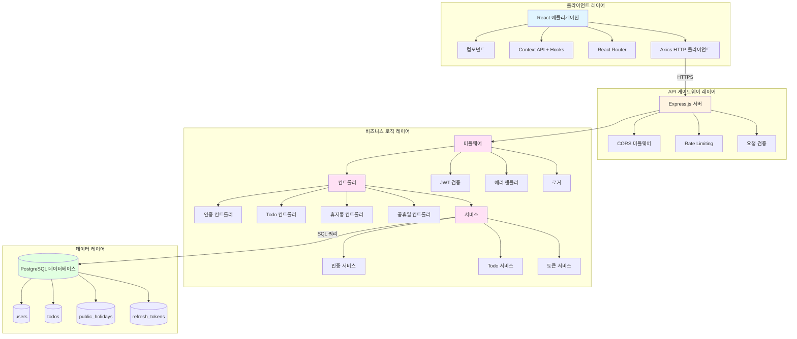
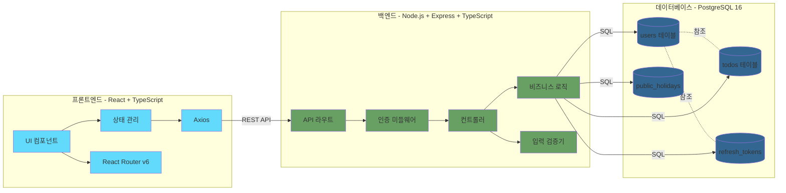
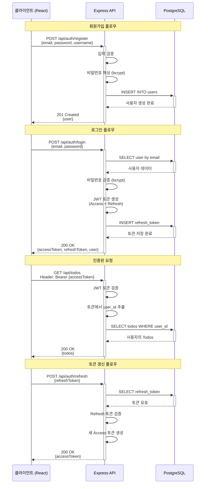
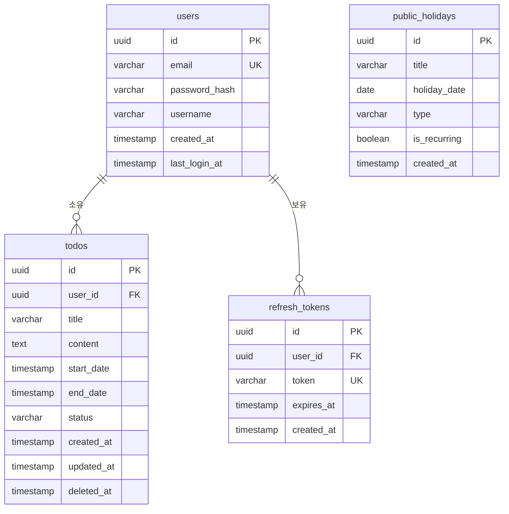
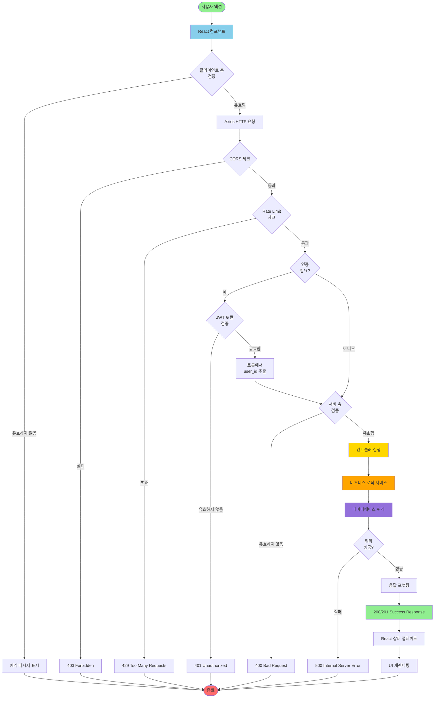
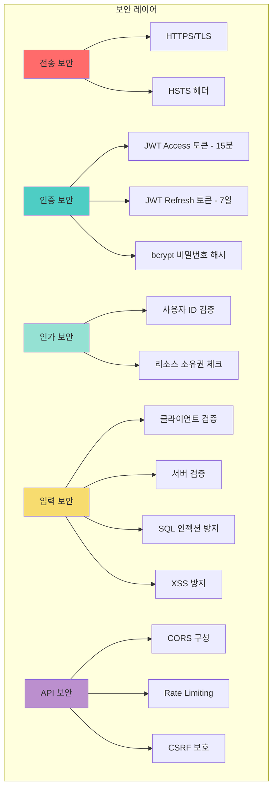
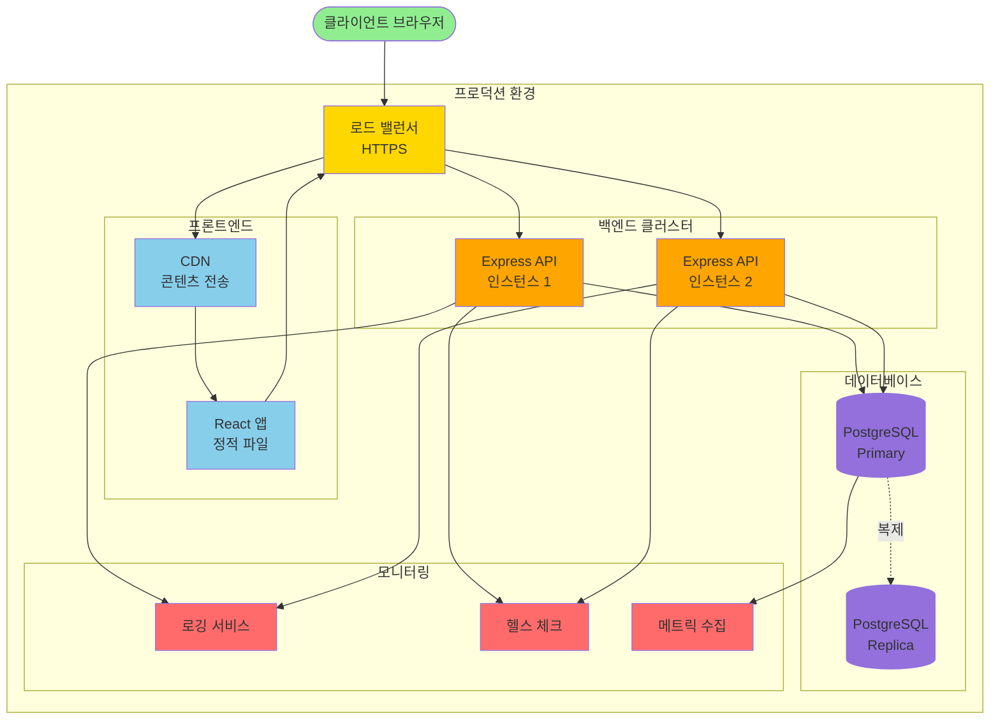

# 기술 아키텍처 다이어그램

> **yt-todolist** - 시스템 아키텍처 개요

---

## 문서 정보

| 항목 | 내용 |
|------|------|
| **문서 버전** | 1.0 |
| **작성일** | 2025-11-26 |
| **작성자** | 개발팀 |
| **상태** | 최종 |

---

## 1. 아키텍처 개요

이 문서는 yt-todolist 애플리케이션 아키텍처에 대한 포괄적인 뷰를 제공합니다. 시스템은 프레젠테이션 레이어(React 프론트엔드), 애플리케이션 레이어(Node.js/Express 백엔드), 데이터 레이어(PostgreSQL 데이터베이스) 간의 명확한 관심사 분리를 갖춘 전통적인 3계층 아키텍처 패턴을 따릅니다.

### 주요 아키텍처 원칙

- **계층화된 아키텍처**: 클라이언트, API, 비즈니스 로직, 데이터 레이어 간의 명확한 분리
- **무상태 API**: 수평 확장을 가능하게 하는 JWT 기반 인증
- **RESTful 설계**: 표준 HTTP 메서드 및 리소스 기반 엔드포인트
- **보안 우선**: HTTPS, JWT 토큰, bcrypt 비밀번호 해싱, 입력 유효성 검사
- **데이터 격리**: 데이터베이스 및 API 레벨에서 사용자별 데이터 접근 제어 강제

---

## 2. 시스템 아키텍처 다이어그램



---

## 3. 상세 컴포넌트 아키텍처



---

## 4. 인증 플로우 다이어그램



---

## 5. API 엔드포인트 구조

```mermaid
graph TD
    API["/api"]

    Auth["/auth"]
    Auth1["/register - POST"]
    Auth2["/login - POST"]
    Auth3["/refresh - POST"]
    Auth4["/logout - POST"]

    Todos["/todos"]
    Todos1["/GET - 모든 todo 목록"]
    Todos2["/:id - GET - todo 조회"]
    Todos3["/POST - todo 생성"]
    Todos4["/:id - PUT - todo 수정"]
    Todos5["/:id - DELETE - 휴지통으로 이동"]

    Trash["/trash"]
    Trash1["/GET - 휴지통 항목 목록"]
    Trash2["/:id/restore - POST"]
    Trash3["/:id - DELETE - 영구 삭제"]

    Holidays["/holidays"]
    Holidays1["/GET - 공휴일 목록"]

    Calendar["/calendar"]
    Calendar1["/GET - 통합 뷰"]

    API --> Auth
    API --> Todos
    API --> Trash
    API --> Holidays
    API --> Calendar

    Auth --> Auth1
    Auth --> Auth2
    Auth --> Auth3
    Auth --> Auth4

    Todos --> Todos1
    Todos --> Todos2
    Todos --> Todos3
    Todos --> Todos4
    Todos --> Todos5

    Trash --> Trash1
    Trash --> Trash2
    Trash --> Trash3

    Holidays --> Holidays1
    Calendar --> Calendar1

    style API fill:#ff6b6b
    style Auth fill:#4ecdc4
    style Todos fill:#95e1d3
    style Trash fill:#f7dc6f
    style Holidays fill:#bb8fce
    style Calendar fill:#85c1e9
```



---

## 6. 데이터베이스 스키마 관계



---

## 7. 요청/응답 플로우



---

## 8. 보안 아키텍처



---

## 9. 기술 스택 요약

### 프론트엔드 스택
- **프레임워크**: React 18
- **언어**: TypeScript 5.x
- **상태 관리**: React Context API + Hooks
- **라우팅**: React Router v6
- **HTTP 클라이언트**: Axios
- **UI 라이브러리**: Material-UI v5 또는 Tailwind CSS
- **폼 처리**: React Hook Form
- **날짜 처리**: date-fns
- **빌드 도구**: Vite

### 백엔드 스택
- **런타임**: Node.js 20 LTS
- **프레임워크**: Express.js 4.x
- **언어**: TypeScript 5.x
- **인증**: jsonwebtoken, bcrypt
- **검증**: express-validator 또는 Zod
- **데이터베이스 클라이언트**: node-postgres (pg)
- **로깅**: Winston 또는 Pino
- **환경변수**: dotenv

### 데이터베이스 스택
- **데이터베이스**: PostgreSQL 16
- **커넥션 풀링**: pg-pool
- **ORM**: Prisma (선택사항) 또는 raw SQL

### DevOps 스택
- **컨테이너화**: Docker
- **CI/CD**: GitHub Actions
- **버전 관리**: Git
- **패키지 매니저**: npm 또는 yarn

---

## 10. 배포 아키텍처



---

## 11. 데이터 플로우 예시

### 예시 1: Todo 생성 플로우

```
사용자 → React 폼 → 검증 → Axios POST /api/todos
    → Express 라우터 → JWT 미들웨어 (토큰 검증)
    → 검증 미들웨어 (입력 체크)
    → Todo 컨트롤러 → Todo 서비스
    → PostgreSQL INSERT → 새 todo 반환
    → 서비스 → 컨트롤러 → API 응답
    → Axios → React 상태 업데이트 → UI 재렌더링
```

### 예시 2: 삭제 및 복원 플로우

```
사용자가 삭제 클릭 → Axios DELETE /api/todos/:id
    → JWT 검증 → 소유권 체크
    → UPDATE todos SET status='trash', deleted_at=NOW()
    → 성공 반환 → UI 업데이트 (목록에서 제거)

사용자가 복원 클릭 → Axios POST /api/trash/:id/restore
    → JWT 검증 → 소유권 체크
    → UPDATE todos SET status='active', deleted_at=NULL
    → 성공 반환 → UI 업데이트 (목록에 다시 추가)
```

---

## 12. 참고사항 및 규칙

### API 규칙
- 모든 API 엔드포인트는 `/api` 접두사 사용
- RESTful 리소스 명명 (복수형 명사)
- JWT 토큰은 `Authorization: Bearer {token}` 헤더에 포함
- 일관된 응답 형식: `{success: boolean, data: object, error: object}`
- HTTP 상태 코드: 200 (OK), 201 (Created), 400 (Bad Request), 401 (Unauthorized), 403 (Forbidden), 404 (Not Found), 500 (Server Error)

### 보안 규칙
- Access 토큰은 15분 후 만료
- Refresh 토큰은 7일 후 만료
- 비밀번호는 bcrypt로 해시화 (10 salt rounds)
- 모든 프로덕션 트래픽에 HTTPS 필수
- Rate limiting: 사용자당 분당 100 요청

### 데이터베이스 규칙
- 모든 테이블에 UUID 기본 키 사용
- 타임스탬프: created_at, updated_at, deleted_at
- 소프트 삭제 패턴 (status='trash', deleted_at 타임스탬프)
- CASCADE 삭제가 포함된 외래 키 제약조건
- 자주 조회되는 컬럼에 인덱스 설정

### 코드 규칙
- TypeScript strict 모드 활성화
- 코드 품질을 위한 ESLint + Prettier
- 함수형 컴포넌트와 Hooks 사용 (React)
- 비동기 작업에 Async/await 사용
- Error-first callbacks 패턴

---

## 관련 문서

- [도메인 정의서](./1-domain-definition.md)
- [PRD 입력 템플릿](./2-prd-input-template.md)
- [제품 요구사항 명세서](./3-prd.md)
- [사용자 시나리오](./4-user-scenarios.md)

---

**문서 버전:** 1.0
**작성일:** 2025-11-26
**작성자:** 개발팀
**상태:** 최종
