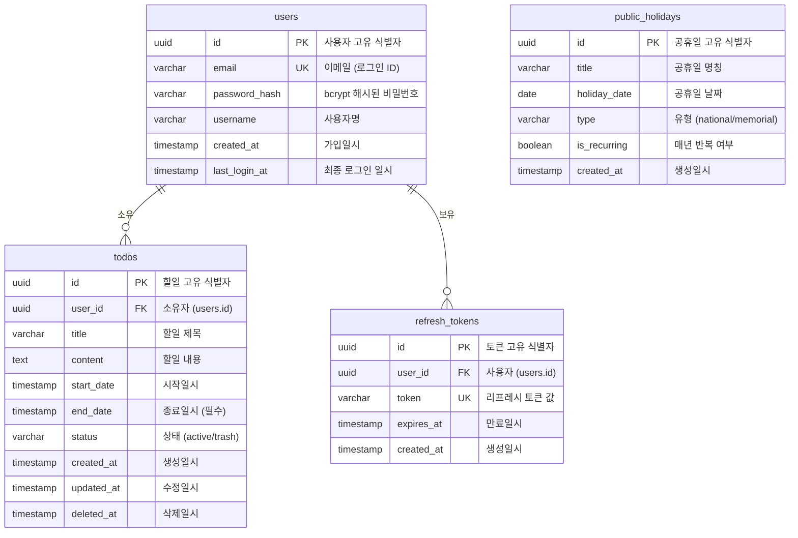

# 데이터 모델 명세서 (ERD)

> **yt-todolist** - 데이터베이스 스키마 및 엔티티 관계 다이어그램

---

## 문서 정보

| 항목 | 내용 |
|------|------|
| **문서 버전** | 1.0 |
| **작성일** | 2025-11-26 |
| **작성자** | 개발팀 |
| **상태** | 최종 |

---

## 1. ERD 개요

이 문서는 yt-todolist 애플리케이션의 데이터베이스 스키마와 엔티티 간의 관계를 정의합니다. PostgreSQL 16을 사용하며, UUID 기반의 기본 키와 명확한 외래 키 관계를 통해 데이터 무결성을 보장합니다.

### 주요 설계 원칙

- **UUID 기본 키**: 모든 테이블에 UUID 타입의 기본 키 사용
- **외래 키 제약조건**: CASCADE 삭제를 통한 참조 무결성 보장
- **소프트 삭제**: 할일(todos)에 대한 소프트 삭제 패턴 적용
- **타임스탬프**: 모든 엔티티에 생성일시 기록
- **인덱스 최적화**: 자주 조회되는 컬럼에 인덱스 설정

---

## 2. 엔티티 관계 다이어그램 (ERD)



---

## 3. 테이블 상세 명세

### 3.1 users (사용자)

사용자 계정 정보를 저장하는 테이블입니다.

| 필드 | 타입 | 제약조건 | 기본값 | 설명 |
|------|------|----------|--------|------|
| id | UUID | PRIMARY KEY | gen_random_uuid() | 사용자 고유 식별자 |
| email | VARCHAR(255) | UNIQUE, NOT NULL | - | 이메일 (로그인 ID) |
| password_hash | VARCHAR(255) | NOT NULL | - | bcrypt 해시된 비밀번호 (salt rounds: 10) |
| username | VARCHAR(100) | NOT NULL | - | 사용자명 (2-50자) |
| created_at | TIMESTAMP | NOT NULL | NOW() | 가입일시 |
| last_login_at | TIMESTAMP | NULL | - | 최종 로그인 일시 |

**제약조건:**
- `chk_email_format`: 이메일 형식 검증 (RFC 5322 준수)
  ```sql
  CHECK (email ~* '^[A-Za-z0-9._%+-]+@[A-Za-z0-9.-]+\.[A-Za-z]{2,}$')
  ```

**인덱스:**
- `idx_users_email`: email 컬럼 인덱스 (빠른 로그인 조회)

**비즈니스 규칙:**
- 이메일은 중복 불가
- 비밀번호는 bcrypt로 해시 후 저장 (원본 저장 금지)
- 사용자 삭제 시 관련 todos, refresh_tokens도 함께 삭제 (CASCADE)

---

### 3.2 todos (할일)

사용자별 할일 정보를 저장하는 테이블입니다.

| 필드 | 타입 | 제약조건 | 기본값 | 설명 |
|------|------|----------|--------|------|
| id | UUID | PRIMARY KEY | gen_random_uuid() | 할일 고유 식별자 |
| user_id | UUID | FOREIGN KEY, NOT NULL | - | 소유자 (users.id 참조) |
| title | VARCHAR(200) | NOT NULL | - | 할일 제목 (최대 200자) |
| content | TEXT | NULL | - | 할일 내용 (최대 2000자) |
| start_date | TIMESTAMP | NULL | - | 시작일시 (선택사항) |
| end_date | TIMESTAMP | NOT NULL | - | 종료일시 (필수) |
| status | VARCHAR(20) | NOT NULL | 'active' | 상태 (active/trash) |
| created_at | TIMESTAMP | NOT NULL | NOW() | 생성일시 |
| updated_at | TIMESTAMP | NOT NULL | NOW() | 수정일시 |
| deleted_at | TIMESTAMP | NULL | - | 삭제일시 (휴지통 이동 시 기록) |

**제약조건:**
- `status CHECK`: status IN ('active', 'trash')
- `chk_date_order`: start_date가 있을 경우 end_date 이전이어야 함
  ```sql
  CHECK (start_date IS NULL OR start_date <= end_date)
  ```

**외래 키:**
- `user_id REFERENCES users(id) ON DELETE CASCADE`

**인덱스:**
- `idx_todos_user_id`: user_id 컬럼 인덱스 (사용자별 조회)
- `idx_todos_status`: status 컬럼 인덱스 (active/trash 필터링)
- `idx_todos_end_date`: end_date 컬럼 인덱스 (날짜 범위 조회)
- `idx_todos_deleted_at`: deleted_at 컬럼 부분 인덱스 (WHERE status = 'trash')
- `idx_todos_user_status`: (user_id, status) 복합 인덱스 (사용자별 활성 할일 조회 최적화)

**트리거:**
- `update_todos_updated_at`: UPDATE 시 updated_at 자동 갱신

**비즈니스 규칙:**
- 모든 할일은 특정 사용자에게 속함 (user_id 필수)
- 삭제 시 status='trash', deleted_at=NOW()로 변경 (소프트 삭제)
- 복원 시 status='active', deleted_at=NULL로 변경
- 영구 삭제는 휴지통 상태에서만 가능

---

### 3.3 public_holidays (공휴일)

대한민국 공휴일 정보를 저장하는 테이블입니다. 모든 사용자가 공유하는 데이터입니다.

| 필드 | 타입 | 제약조건 | 기본값 | 설명 |
|------|------|----------|--------|------|
| id | UUID | PRIMARY KEY | gen_random_uuid() | 공휴일 고유 식별자 |
| title | VARCHAR(200) | NOT NULL | - | 공휴일 명칭 (예: 설날, 추석) |
| holiday_date | DATE | NOT NULL | - | 공휴일 날짜 |
| type | VARCHAR(20) | NOT NULL | - | 유형 (national/memorial) |
| is_recurring | BOOLEAN | NOT NULL | FALSE | 매년 반복 여부 |
| created_at | TIMESTAMP | NOT NULL | NOW() | 생성일시 |

**제약조건:**
- `type CHECK`: type IN ('national', 'memorial')

**인덱스:**
- `idx_holidays_date`: holiday_date 컬럼 인덱스 (날짜 범위 조회)
- `idx_holidays_type`: type 컬럼 인덱스 (유형별 필터링)

**비즈니스 규칙:**
- 사용자와 독립적인 공통 데이터
- national: 국경일 (신정, 삼일절, 광복절 등)
- memorial: 기념일 (현충일 등)
- is_recurring=true: 매년 동일한 날짜에 반복 (예: 신정 1월 1일)
- is_recurring=false: 음력 기반 공휴일 (예: 설날, 추석)

---

### 3.4 refresh_tokens (리프레시 토큰)

JWT Refresh Token을 관리하는 테이블입니다.

| 필드 | 타입 | 제약조건 | 기본값 | 설명 |
|------|------|----------|--------|------|
| id | UUID | PRIMARY KEY | gen_random_uuid() | 토큰 고유 식별자 |
| user_id | UUID | FOREIGN KEY, NOT NULL | - | 사용자 (users.id 참조) |
| token | VARCHAR(500) | UNIQUE, NOT NULL | - | 리프레시 토큰 값 (JWT) |
| expires_at | TIMESTAMP | NOT NULL | - | 만료일시 (생성 시각 + 7일) |
| created_at | TIMESTAMP | NOT NULL | NOW() | 생성일시 |

**제약조건:**
- `chk_expires_future`: expires_at > created_at (만료일이 미래여야 함)

**외래 키:**
- `user_id REFERENCES users(id) ON DELETE CASCADE`

**인덱스:**
- `idx_refresh_tokens_user_id`: user_id 컬럼 인덱스
- `idx_refresh_tokens_token`: token 컬럼 인덱스 (토큰 검증)
- `idx_refresh_tokens_expires_at`: expires_at 컬럼 인덱스 (만료 토큰 정리)

**비즈니스 규칙:**
- Access Token 갱신 시 사용
- 만료 기간: 7일
- 로그아웃 시 해당 토큰 삭제
- 주기적으로 만료된 토큰 정리 필요

---

## 4. 관계 설명

### 4.1 users ↔ todos (1:N)

- **관계 유형**: 일대다 (One-to-Many)
- **관계 설명**: 한 명의 사용자는 여러 개의 할일을 소유할 수 있음
- **외래 키**: todos.user_id → users.id
- **삭제 규칙**: CASCADE (사용자 삭제 시 모든 할일도 삭제)
- **비즈니스 규칙**:
  - 모든 할일은 반드시 소유자가 있어야 함
  - 사용자는 자신의 할일만 조회/수정/삭제 가능 (BR-002)

### 4.2 users ↔ refresh_tokens (1:N)

- **관계 유형**: 일대다 (One-to-Many)
- **관계 설명**: 한 명의 사용자는 여러 개의 리프레시 토큰을 보유할 수 있음 (다중 기기 로그인)
- **외래 키**: refresh_tokens.user_id → users.id
- **삭제 규칙**: CASCADE (사용자 삭제 시 모든 토큰도 삭제)
- **비즈니스 규칙**:
  - 로그인 시 새로운 토큰 생성
  - 로그아웃 시 해당 토큰 삭제
  - 만료된 토큰은 주기적으로 정리

### 4.3 public_holidays (독립 엔티티)

- **관계 유형**: 독립 엔티티
- **관계 설명**: 다른 엔티티와 외래 키 관계 없음
- **비즈니스 규칙**:
  - 모든 사용자가 공유하는 공통 데이터
  - 관리자만 추가/수정/삭제 가능
  - 캘린더 뷰에서 할일과 함께 표시

---

## 5. 인덱스 전략

### 5.1 성능 최적화 인덱스

| 테이블 | 인덱스명 | 컬럼 | 목적 |
|--------|----------|------|------|
| users | idx_users_email | email | 로그인 시 빠른 사용자 조회 |
| todos | idx_todos_user_id | user_id | 사용자별 할일 목록 조회 |
| todos | idx_todos_status | status | active/trash 필터링 |
| todos | idx_todos_end_date | end_date | 날짜 범위 조회 및 정렬 |
| todos | idx_todos_deleted_at | deleted_at (WHERE status='trash') | 휴지통 항목 조회 |
| todos | idx_todos_user_status | user_id, status | 사용자별 활성 할일 조회 최적화 (복합 인덱스) |
| public_holidays | idx_holidays_date | holiday_date | 날짜 범위 조회 |
| public_holidays | idx_holidays_type | type | 유형별 필터링 |
| refresh_tokens | idx_refresh_tokens_user_id | user_id | 사용자별 토큰 조회 |
| refresh_tokens | idx_refresh_tokens_token | token | 토큰 검증 |
| refresh_tokens | idx_refresh_tokens_expires_at | expires_at | 만료 토큰 정리 |

### 5.2 인덱스 사용 쿼리 예시

```sql
-- users 테이블: 로그인 시 이메일로 사용자 조회
SELECT * FROM users WHERE email = 'user@example.com';
-- → idx_users_email 사용

-- todos 테이블: 사용자별 활성 할일 조회
SELECT * FROM todos WHERE user_id = '...' AND status = 'active';
-- → idx_todos_user_status 사용 (복합 인덱스로 최적화됨)

-- todos 테이블: 날짜 범위로 할일 조회
SELECT * FROM todos
WHERE user_id = '...'
  AND end_date BETWEEN '2025-11-01' AND '2025-11-30'
ORDER BY end_date;
-- → idx_todos_user_id, idx_todos_end_date 사용

-- public_holidays 테이블: 특정 월의 공휴일 조회
SELECT * FROM public_holidays
WHERE holiday_date BETWEEN '2025-11-01' AND '2025-11-30';
-- → idx_holidays_date 사용
```

---

## 6. 제약조건 및 검증 규칙

### 6.1 데이터 무결성 제약조건

#### users 테이블
- **이메일 형식**: 정규식 패턴 검증
- **이메일 중복**: UNIQUE 제약조건
- **필수 필드**: email, password_hash, username

#### todos 테이블
- **날짜 순서**: start_date ≤ end_date
- **상태 값**: 'active' 또는 'trash'만 허용
- **필수 필드**: user_id, title, end_date
- **제목 길이**: 1-200자
- **내용 길이**: 0-2000자

#### public_holidays 테이블
- **유형 값**: 'national' 또는 'memorial'만 허용
- **필수 필드**: title, holiday_date, type

#### refresh_tokens 테이블
- **토큰 중복**: UNIQUE 제약조건
- **만료일**: created_at보다 미래여야 함
- **필수 필드**: user_id, token, expires_at

### 6.2 외래 키 제약조건

모든 외래 키는 `ON DELETE CASCADE` 규칙을 따릅니다:

```sql
-- todos.user_id
ALTER TABLE todos
ADD CONSTRAINT fk_todos_user_id
FOREIGN KEY (user_id) REFERENCES users(id) ON DELETE CASCADE;

-- refresh_tokens.user_id
ALTER TABLE refresh_tokens
ADD CONSTRAINT fk_refresh_tokens_user_id
FOREIGN KEY (user_id) REFERENCES users(id) ON DELETE CASCADE;
```

---

## 7. 트리거 및 자동화

### 7.1 updated_at 자동 갱신 트리거

todos 테이블의 updated_at 컬럼은 레코드 수정 시 자동으로 현재 시각으로 갱신됩니다.

```sql
-- 트리거 함수
CREATE OR REPLACE FUNCTION update_updated_at_column()
RETURNS TRIGGER AS $$
BEGIN
    NEW.updated_at = NOW();
    RETURN NEW;
END;
$$ language 'plpgsql';

-- 트리거
CREATE TRIGGER update_todos_updated_at
BEFORE UPDATE ON todos
FOR EACH ROW
EXECUTE FUNCTION update_updated_at_column();
```

### 7.2 향후 추가 고려사항

- **만료 토큰 자동 정리**: refresh_tokens의 만료된 토큰 주기적 삭제
- **소프트 삭제 정리**: 휴지통에 30일 이상 있는 항목 자동 영구 삭제
- **감사 로그**: 중요 작업에 대한 audit log 테이블 추가

---

## 8. SQL 스키마 정의

### 8.1 전체 스키마 생성 스크립트

```sql
-- ========================================
-- 1. 사용자 테이블
-- ========================================
CREATE TABLE users (
  id UUID PRIMARY KEY DEFAULT gen_random_uuid(),
  email VARCHAR(255) UNIQUE NOT NULL,
  password_hash VARCHAR(255) NOT NULL,
  username VARCHAR(100) NOT NULL,
  created_at TIMESTAMP DEFAULT NOW(),
  last_login_at TIMESTAMP,
  CONSTRAINT chk_email_format CHECK (email ~* '^[A-Za-z0-9._%+-]+@[A-Za-z0-9.-]+\.[A-Za-z]{2,}$')
);

-- 이메일 인덱스
CREATE INDEX idx_users_email ON users(email);

-- ========================================
-- 2. 할일 테이블
-- ========================================
CREATE TABLE todos (
  id UUID PRIMARY KEY DEFAULT gen_random_uuid(),
  user_id UUID NOT NULL REFERENCES users(id) ON DELETE CASCADE,
  title VARCHAR(200) NOT NULL,
  content TEXT,
  start_date TIMESTAMP,
  end_date TIMESTAMP NOT NULL,
  status VARCHAR(20) DEFAULT 'active' CHECK (status IN ('active', 'trash')),
  created_at TIMESTAMP DEFAULT NOW(),
  updated_at TIMESTAMP DEFAULT NOW(),
  deleted_at TIMESTAMP,
  CONSTRAINT chk_date_order CHECK (start_date IS NULL OR start_date <= end_date)
);

-- 할일 인덱스
CREATE INDEX idx_todos_user_id ON todos(user_id);
CREATE INDEX idx_todos_status ON todos(status);
CREATE INDEX idx_todos_end_date ON todos(end_date);
CREATE INDEX idx_todos_deleted_at ON todos(deleted_at) WHERE status = 'trash';

-- 업데이트 타임스탬프 자동 갱신 함수
CREATE OR REPLACE FUNCTION update_updated_at_column()
RETURNS TRIGGER AS $$
BEGIN
    NEW.updated_at = NOW();
    RETURN NEW;
END;
$$ language 'plpgsql';

-- 업데이트 트리거
CREATE TRIGGER update_todos_updated_at BEFORE UPDATE ON todos
FOR EACH ROW EXECUTE FUNCTION update_updated_at_column();

-- ========================================
-- 3. 공휴일 테이블
-- ========================================
CREATE TABLE public_holidays (
  id UUID PRIMARY KEY DEFAULT gen_random_uuid(),
  title VARCHAR(200) NOT NULL,
  holiday_date DATE NOT NULL,
  type VARCHAR(20) NOT NULL CHECK (type IN ('national', 'memorial')),
  is_recurring BOOLEAN DEFAULT FALSE,
  created_at TIMESTAMP DEFAULT NOW()
);

-- 공휴일 인덱스
CREATE INDEX idx_holidays_date ON public_holidays(holiday_date);
CREATE INDEX idx_holidays_type ON public_holidays(type);

-- ========================================
-- 4. 리프레시 토큰 테이블
-- ========================================
CREATE TABLE refresh_tokens (
  id UUID PRIMARY KEY DEFAULT gen_random_uuid(),
  user_id UUID NOT NULL REFERENCES users(id) ON DELETE CASCADE,
  token VARCHAR(500) NOT NULL UNIQUE,
  expires_at TIMESTAMP NOT NULL,
  created_at TIMESTAMP DEFAULT NOW(),
  CONSTRAINT chk_expires_future CHECK (expires_at > created_at)
);

-- 리프레시 토큰 인덱스
CREATE INDEX idx_refresh_tokens_user_id ON refresh_tokens(user_id);
CREATE INDEX idx_refresh_tokens_token ON refresh_tokens(token);
CREATE INDEX idx_refresh_tokens_expires_at ON refresh_tokens(expires_at);
```

### 8.2 샘플 데이터 삽입

```sql
-- 공휴일 샘플 데이터
INSERT INTO public_holidays (title, holiday_date, type, is_recurring) VALUES
  ('신정', '2025-01-01', 'national', true),
  ('설날', '2025-01-29', 'national', true),
  ('삼일절', '2025-03-01', 'national', true),
  ('어린이날', '2025-05-05', 'national', true),
  ('현충일', '2025-06-06', 'memorial', true),
  ('광복절', '2025-08-15', 'national', true),
  ('추석', '2025-10-06', 'national', false),
  ('개천절', '2025-10-03', 'national', true),
  ('한글날', '2025-10-09', 'national', true),
  ('크리스마스', '2025-12-25', 'national', true);
```

---

## 9. 데이터 마이그레이션 전략

### 9.1 버전 관리

데이터베이스 스키마 변경은 마이그레이션 도구를 사용하여 관리합니다.

**권장 도구:**
- Prisma Migrate (Prisma 사용 시)
- node-pg-migrate (raw SQL 사용 시)
- Flyway 또는 Liquibase

### 9.2 마이그레이션 원칙

1. **순차적 적용**: 마이그레이션은 순서대로 적용
2. **롤백 가능**: 각 마이그레이션은 되돌릴 수 있어야 함
3. **데이터 보존**: 스키마 변경 시 기존 데이터 보존
4. **테스트**: 프로덕션 적용 전 스테이징 환경에서 테스트

### 9.3 버전 히스토리

| 버전 | 날짜 | 변경 내용 |
|------|------|-----------|
| 1.0 | 2025-11-26 | 초기 스키마 생성 |

---

## 10. 성능 고려사항

### 10.1 쿼리 최적화 전략

1. **인덱스 활용**: 자주 조회되는 컬럼에 인덱스 설정
2. **부분 인덱스**: 조건부 인덱스로 저장 공간 절약
3. **N+1 쿼리 방지**: JOIN을 활용한 일괄 조회
4. **페이지네이션**: LIMIT/OFFSET 사용

### 10.2 커넥션 풀링

```javascript
// node-postgres 커넥션 풀 설정 예시
const pool = new Pool({
  host: process.env.DB_HOST,
  port: process.env.DB_PORT,
  database: process.env.DB_NAME,
  user: process.env.DB_USER,
  password: process.env.DB_PASSWORD,
  max: 20, // 최대 커넥션 수
  idleTimeoutMillis: 30000,
  connectionTimeoutMillis: 2000,
});
```

### 10.3 쿼리 성능 모니터링

```sql
-- 슬로우 쿼리 확인
SELECT query, mean_exec_time, calls
FROM pg_stat_statements
ORDER BY mean_exec_time DESC
LIMIT 10;

-- 인덱스 사용률 확인
SELECT schemaname, tablename, indexname, idx_scan
FROM pg_stat_user_indexes
ORDER BY idx_scan ASC;
```

---

## 11. 보안 고려사항

### 11.1 데이터 보호

- **비밀번호**: 절대 평문 저장 금지, bcrypt 해시 사용
- **개인정보**: 이메일, 사용자명 등 개인정보는 암호화 전송 (HTTPS)
- **SQL Injection 방어**: Parameterized Query 사용

### 11.2 접근 제어

```sql
-- 애플리케이션 전용 사용자 생성
CREATE USER app_user WITH PASSWORD 'secure_password';

-- 필요한 권한만 부여
GRANT SELECT, INSERT, UPDATE, DELETE ON users, todos, refresh_tokens TO app_user;
GRANT SELECT ON public_holidays TO app_user;

-- 스키마 변경 권한은 부여하지 않음
```

### 11.3 데이터 백업

- **일일 백업**: 자동화된 데이터베이스 백업
- **백업 보관**: 최소 30일간 백업 파일 보관
- **복구 테스트**: 주기적인 복구 테스트 수행

---

## 관련 문서

- [도메인 정의서](./1-domain-definition.md)
- [PRD 입력 템플릿](./2-prd-input-template.md)
- [제품 요구사항 명세서](./3-prd.md)
- [사용자 시나리오](./4-user-scenarios.md)
- [기술 아키텍처 다이어그램](./5-arch-diagram.md)

---

**문서 버전:** 1.0
**작성일:** 2025-11-26
**작성자:** 개발팀
**상태:** 최종
